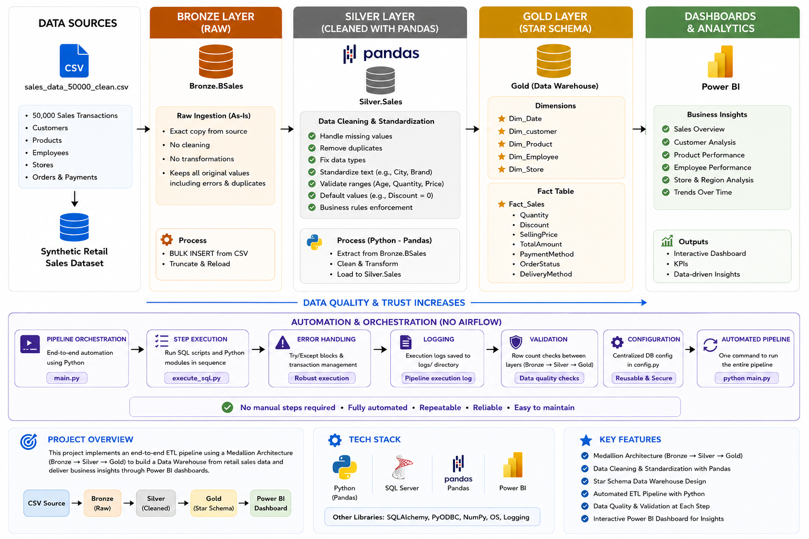
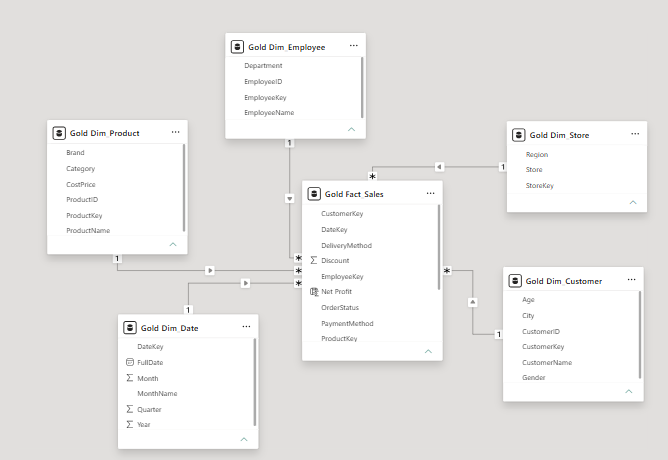
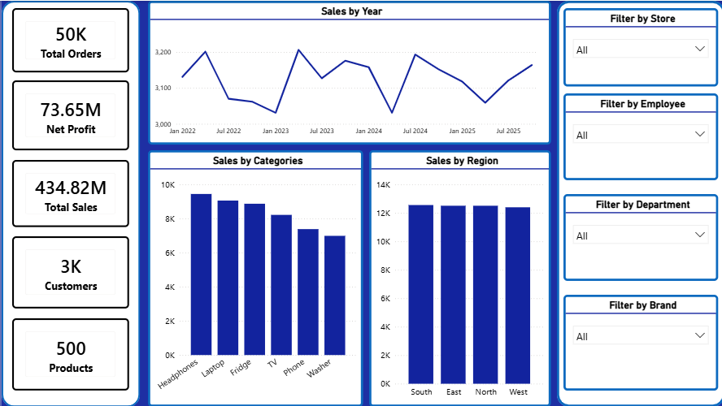
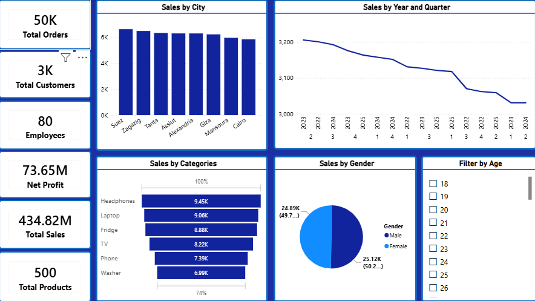

# Sales Data Warehouse & Automated ETL Pipeline

## 📌 Project Overview

This project demonstrates an end-to-end Data Warehouse solution for retail sales data.

The pipeline extracts raw sales data, transforms it through Bronze, Silver, and Gold layers, and loads it into a dimensional model (Star Schema) to support analytics and reporting using Power BI.

---

## 🏗️ Data Warehouse Architecture

The project follows the Medallion Architecture:

- Bronze Layer:
  - Stores raw data as received from the source.
  - No transformations are applied.

- Silver Layer:
  - Data cleaning and transformation using Python.
  - Handles missing values, duplicates, incorrect data types, and data validation.

- Gold Layer:
  - Business-ready data model.
  - Contains Fact and Dimension tables using Star Schema.

---

## 🔄 Data Pipeline Flow

Raw CSV Files
|
↓
Bronze Layer (SQL Server)
|
↓
Silver Layer (Python Pandas)
|
↓
Gold Layer (Star Schema)
|
↓
Power BI Dashboard

---

## 🛠️ Technologies Used

- SQL Server
- Python (Pandas, NumPy)
- Power BI
- GitHub
- ETL Concepts
- Data Warehousing
- Star Schema Modeling

---

## 📂 Project Structure

Retail-Sales-Data-Warehouse/

├── sql/
│ ├── 01_setup.sql
│ ├── 02_load_bronze.sql
│ └── 03_load_gold.sql

├── scripts/
│ ├── clean_silver.py
│ ├── execute_sql.py
│ └── main.py

├── dashboard/
│ └── Sales_Dashboard.pbix

├── images/
│ ├── architecture.png
│ ├── dashboard_sales.png
│ ├── dashboard_customers.png
│ └── star_schema.png

---

## ⭐ Data Model (Star Schema)

The Gold Layer contains:

### Fact Table
- Fact Sales

### Dimension Tables
- Dim Customer
- Dim Product
- Dim Date

---

## 📊 Power BI Dashboard

The dashboard provides insights about:

- Total Sales
- Revenue Analysis
- Customer Performance
- Product Performance
- Sales Trends

---

